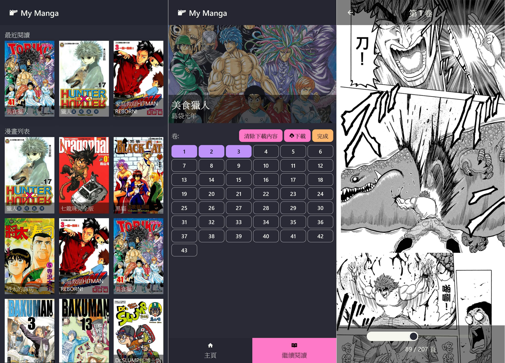

## Comic Reader - PWA + SvelteKit + TailwindCSS

My offline-first comic / manga PWA reader, primarily for Kobo manga, developed with SvelteKit.

[Blog Post in Chinese](https://auphone.net/posts/自製離線優先的kobo漫畫閱讀web-app[PWA])

## Screenshots



## Getting Started

```sh
git clone https://github.com/auphone/comic-reader.git

cd comic-reader
bun install
```

Create .env

```sh
cp .env.example .env
```

Point the `COMIC_ROOT` env variable to your comic directory, (optional) point `KOBODL_ROOT` to kobodl output directory **(more detail in "Download kobo comics" section)**

```sh
bun dev
```

Start dev at http://localhost:5555

## Download kobo comics (Use at your own risk)

You can use this unofficial tool - [kobo-book-downloader](https://github.com/subdavis/kobo-book-downloader) to download purchased kobo books from your account. If you have no luck getting the credentials like me, you can try to use [this old tool](https://github.com/TnS-hun/kobo-book-downloader) to get them, but then you will need to modify the `~/.config/kobodl.json` by yourself

Once you have downloaded the epubs, update the `KOBODL_ROOT` environment variable, point it to the epub download path, then run the script to convert epub to images

```sh
bun run scripts/epub-to-image.ts
```

`KOBODL_ROOT` is only for this script, you don't need it in runtime

Sample Output

```sh
❯ bun run scripts/epub-to-image.ts
[28.47ms] 矢吹健太朗 - 黑貓 (15) e5927186.epub
[32.38ms] 大場鶫 - 爆漫王 (6) 79d02df0.epub
[76.64ms] Tsutomu Nihei - BLAME! 3 89f6ec95.epub
[25.91ms] 冨樫義博 - 獵人 (20) 158e750a.epub
[27.59ms] 大場鶫 - 爆漫王 (20) 16be4204.epub
[11.99ms] 天野 明 - 家庭教師HITMAN REBORN! (17) 42620225.epub
[32.58ms] 冨樫義博 - 獵人 (13) edf987e5.epub
[22.91ms] 島袋光年 - 美食獵人 (23) fda27cda.epub
```
